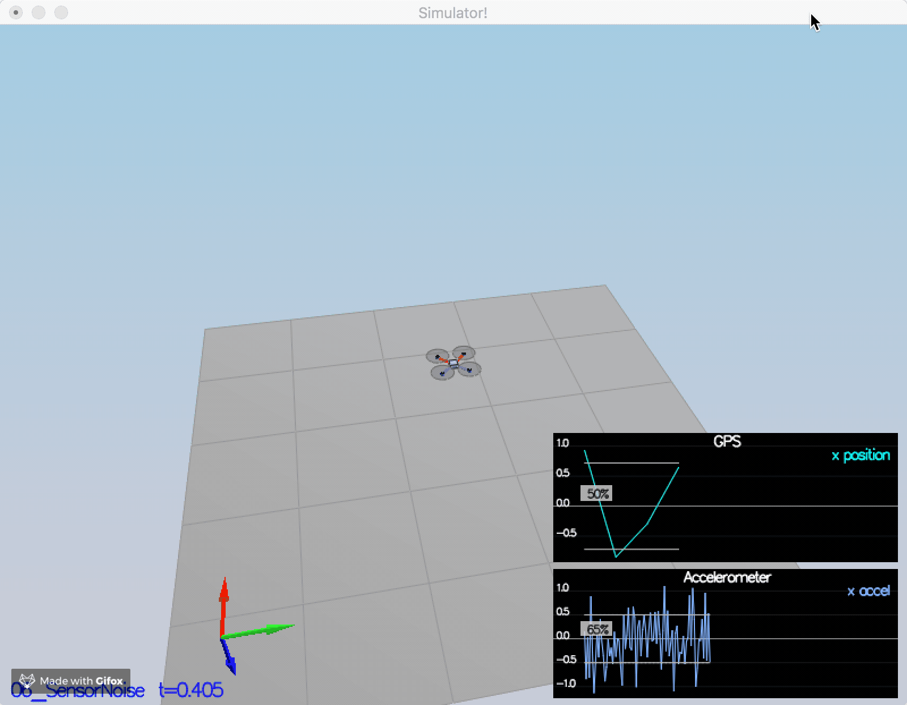
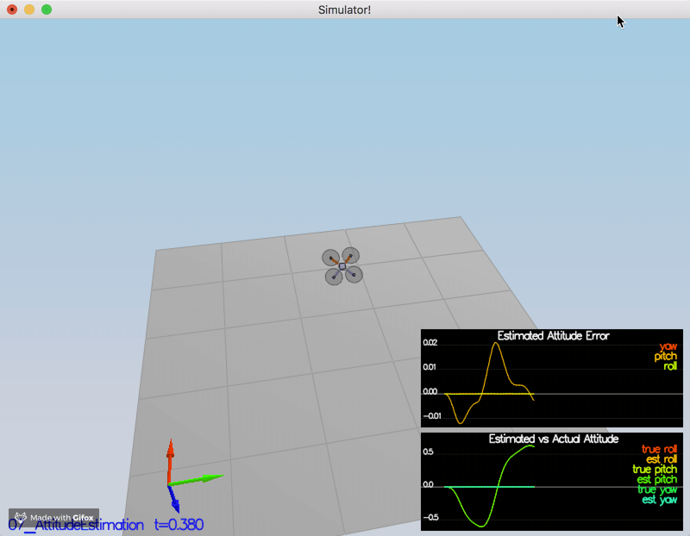
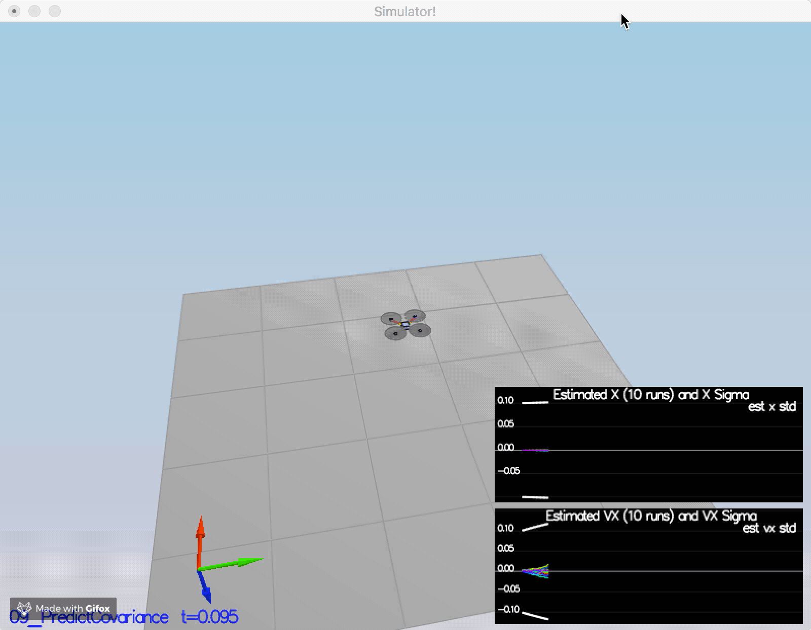
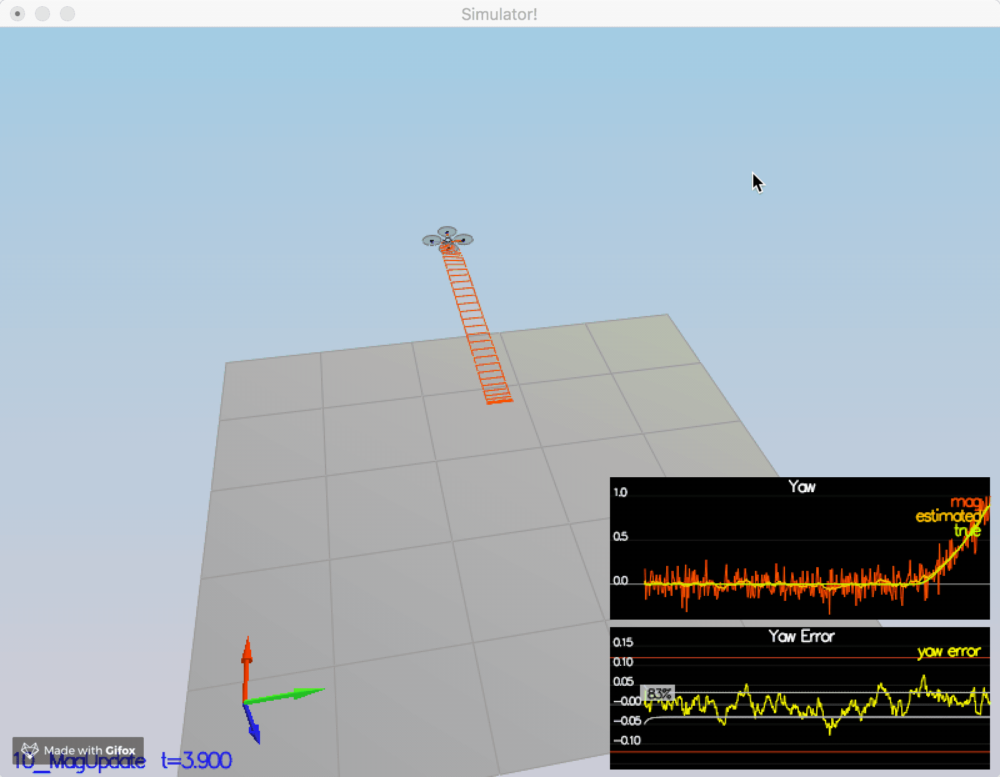
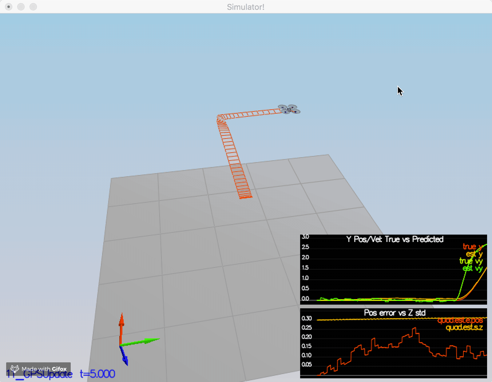

## Project: Building an Estimator

### Step 1. Sensor Noise
#### Determine the standard deviation of the measurement noise of both GPS X data and Accelerometer X data.
Run "Scenario 6 Sensor Noise", and find the standard deviation from the log files.

Then change parameters in "06_SensorNoise.txt":

MeasuredStdDev_GPSPosXY = 0.72

MeasuredStdDev_AccelXY = 0.50

Run "Scenario 6 Sensor Noise" again, about 68% data located in 1 standard deviation.

#### Scenario 6 Sensor Noise

### Step 2. Attitude Estimation
#### Implement a better rate gyro attitude integration scheme in the UpdateFromIMU() function.

Create a quaternion by FromEuler123_RPY() function :

Quaternion<float> quater = Quaternion<float>::FromEuler123_RPY(rollEst, pitchEst, ekfState(6));

then intergrate the body rate:

quater.IntegrateBodyRate(gyro, dtIMU);

and find the new angles:

float predictedRoll = quater.Roll();

float predictedPitch = quater.Pitch();

ekfState(6) = quater.Yaw();

#### Scenario 7 Attitude Estimation

### Step 3. Prediction Step
#### Implement all of the elements of the prediction step for the estimator.

In function PredictState(), we update the state from time t to t+dt based on the current state,
In function GetRbgPrime(), find the RbgPrime() maxtrix by the equations provided in "estimation-quadrotors.pdf",
In function Predict(), update the gPrime() matrix by algorithm 2 in "estimation-quadrotors.pdf".

#### Scenario 8 Prediction State

#### Scenario 9 Prediction Covariance

### Step 4: Magnetometer Update
#### Implement the magnetometer update.

In function UpdateFromMag(), set the hPrime(0,6) = 1.f, then zFromX = hPrime * ekfState;

plus or minus 2 pi on zFromX(0) to make sure that the difference with z(0) is small.

#### Scenario 10 Magnetometer Update

### Step 5: Closed Loop + GPS Update
#### Implement the GPS update.

In function UpdateFromGPS(), set hPrime() as an identity matrix, then zFromX = hPrime * ekfState;

#### Scenario 11 Closed Loop + GPS Update

### Step 6: Adding Your Controller

1. Replace QuadController.cpp with the controller you wrote in the last project.

2. Replace QuadControlParams.txt with the control parameters you came up with in the last project.

3. Run scenario 11_GPSUpdate.

#### Scenario 11 for Adding Your Controller

